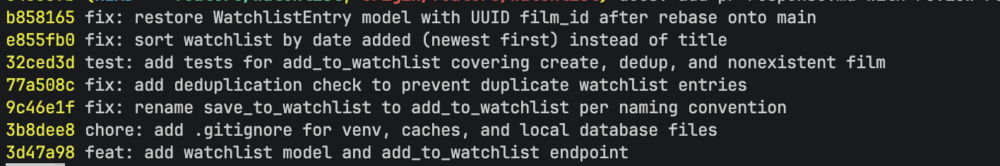

# PR Response Doc — CineLog Watchlist Feature

## AI Usage
I used Claude (Claude Code) throughout this project in a few specific ways:

- **Codebase orientation:** Before reading the review comments, I had it read `models.py`, `services/collection_service.py`, `tests/test_collection.py`, and the existing watchlist code to summarize the naming convention (`verb_to_noun`), the deduplication pattern (`AlreadyInXError` + `.filter_by(...).first()` check before insert), and the test fixture structure. I cross-checked this against the actual source before relying on it — this surfaced the deduplication pattern I mirrored for Comment 2.
- **Fetching and reading the PR review comments:** Used the `gh` CLI (`gh api repos/.../pulls/1/comments` and `gh pr view 1 --json comments`) to pull the exact text of all six review comments (3 inline, 3 general) directly from the upstream PR, rather than guessing at their content.
- **Devil's-advocate stress test on Comments 4 and 5:** After drafting my visibility and sort-order responses, I asked Claude what counterargument a careful reviewer would raise. For Comment 4, it pointed out that "some future UI work will handle it" is a weak mitigation if it's not actually scoped anywhere — I kept my position (public default) but tightened the tradeoff paragraph to be explicit that the per-entry `public` field is the actual, present-day mitigation, not a hypothetical future feature. For Comment 5, no new gap was surfaced beyond what I'd already written (the alphabetical-lookup counter-case), so I kept my reasoning as drafted.
- **Rebase debugging:** During Comment 6, the rebase completed with no reported conflicts, but `pytest` still would have failed silently at runtime because `WatchlistEntry` had been dropped from `models.py` by `main`'s UUID refactor commit. I used Claude to diff the pre- and post-rebase state of `models.py` commit-by-commit (`git show <sha> -- models.py`) to trace exactly which commit caused the silent deletion, rather than assuming git's "successful" rebase meant the merge was semantically correct.
- **Commit history rewrite:** Used an interactive rebase (scripted via `GIT_SEQUENCE_EDITOR`/`GIT_EDITOR` to make it non-interactive) to reword and squash commits into the conventional-commit history below, then manually checked the result against the Conventional Commits spec (type prefix, one logical change per commit, imperative summary line) rather than trusting the automation blindly.

## Comment 1 — Rename
**What I did:** Renamed `save_to_watchlist()` to `add_to_watchlist()` in `services/watchlist_service.py` to match the project's `verb_to_noun` naming convention already used by `add_to_collection()` in `collection_service.py`. Updated the docstring's first line ("Save a film..." → "Add a film...") and the one call site in `routes/watchlist/watchlist.py` (both the import and the function call).
**How I verified:** Ran `grep -rn "save_to_watchlist" --include="*.py" .` across the whole repo after the edit and got no matches, confirming no call sites were missed. Also re-ran the full test suite (`pytest tests/ -v`) to confirm nothing else depended on the old name.

## Comment 2 — Deduplication
**What I did:** Followed the exact pattern from `add_to_collection()` in `collection_service.py`: added a new `AlreadyInWatchlistError` exception class, and in `add_to_watchlist()` added a `WatchlistEntry.query.filter_by(user_id=..., film_id=...).first()` check before creating the entry, raising `AlreadyInWatchlistError` if a match is found. Also updated the `/watchlist/<user_id>/add` route to catch `FilmNotFoundError` (404) and `AlreadyInWatchlistError` (409), matching the try/except structure already used in `routes/collection.py`'s `add_film` handler.
**How I verified:** Wrote a small manual script that adds the same film to a watchlist twice and confirmed the second call raises `AlreadyInWatchlistError` instead of silently creating a duplicate row, and confirmed `FilmNotFoundError` still fires correctly for a nonexistent film. Also re-ran the full `pytest tests/ -v` suite to confirm no regressions.

## Comment 3 — Missing test
**What I did:** Created `tests/test_watchlist.py` mirroring the fixture and assertion structure of `tests/test_collection.py`. Reused the same `app`, `sample_user`, and `sample_film` fixture patterns, and wrote `test_add_to_watchlist_nonexistent_film_raises` as the direct equivalent of `test_add_to_collection_nonexistent_film_raises` — it calls `add_to_watchlist()` with a fake UUID and asserts `FilmNotFoundError` is raised. I also added `test_add_to_watchlist_creates_entry` and `test_add_to_watchlist_duplicate_raises` (mirroring the collection tests) since Comment 2's dedup logic needed the same test coverage the collection service already has.
**How I verified:** Ran `pytest tests/test_watchlist.py -v` — all 3 tests pass — then ran the full suite `pytest tests/ -v` (7 tests total) to confirm no regressions in the existing collection tests.

## Comment 4 — Default visibility
**My position:** Keep `public=True` as the default for new watchlist entries.

**Reasoning:** CineLog is a social film-logging app — the whole value of a "collection" and "watchlist" feature in this kind of product (in the same category as Letterboxd) comes from other users being able to see what you've watched and what you want to watch. Discovery is a core loop: users find new films by browsing what people they follow are planning to watch. If watchlists default to private, that loop never gets seeded — a brand-new user's watchlist is invisible by default, and the feature quietly becomes a personal to-do list instead of a social one. Defaulting to public also matches the implicit precedent already set by `CollectionEntry`, which has no visibility flag at all (it's always effectively public) — introducing an inconsistent default where watchlists are private-by-default and collections are always public would be a confusing, undocumented asymmetry between two very similar features.

**Tradeoff acknowledged:** The real cost of `public=True` is that some users won't realize their "want to watch" list — which can reveal more about personal taste, mood, or even sensitive interests (e.g., films about a specific personal circumstance) than a list of films already watched — is visible to others until after they've added several entries. This is a real privacy surprise risk. I'm not solving it with a different default; instead this should be paired with a one-time, clearly visible visibility indicator in the client UI when a user adds their first watchlist item (out of scope for this PR, which is API-only), and the `public` field is already per-entry rather than account-wide, so a privacy-conscious user can flip individual entries to private without opting out of the feature entirely.

## Comment 5 — Sort order
**My position:** Implemented the maintainer's preference — `get_watchlist()` now sorts by `date_added` descending (most recently added first), replacing the original alphabetical-by-title order.

**Reasoning:** A watchlist is fundamentally a queue of intent, not a reference catalog. Alphabetical order is useful when you're looking something up by name, but a watchlist's primary use case is "what did I just decide I wanted to watch" — which is inherently chronological, not alphabetical. This also brings `get_watchlist()` in line with `get_collection()`, which already sorts by `date_added.desc()`. Having one sort convention (`collection`) sort newest-first and the other (`watchlist`) sort alphabetically would be an inconsistency a user would notice immediately when moving between the two views, with no functional justification for the difference.

**Engagement with reviewer's point:** I agree with the maintainer's core argument — "most users want to see what they added recently" — and don't see a strong counter-case for this feature specifically. The one scenario where alphabetical sorting helps is a large watchlist where a user is trying to find one specific film they remember adding, but that's a search/filter problem, not a default-sort problem, and solving it by sacrificing the more common "what's new" use case as the default would be optimizing for the rarer interaction. If we ever add per-user sort preferences, alphabetical could become an opt-in secondary view rather than the default. Added `test_get_watchlist_returns_newest_first` (mirroring `test_get_collection_returns_newest_first`) to lock in the new behavior. While making this change I also found and fixed a latent bug: `WatchlistEntry` had no relationship back to `Film` in `models.py`, so `entry.film.to_dict()` inside `get_watchlist()` would have raised `AttributeError` on any real call — it was never exercised by an existing test. Added `Film.watchlist_entries` (mirroring the existing `Film.collection_entries` relationship) to fix it.

## Comment 6 — Rebase
**What conflicted:** Ran `git fetch origin && git rebase origin/main`. There was one syntactic conflict, in `.gitignore` (both my branch and `main` had independently added a `.gitignore`, with different entries) — resolved by keeping the union of both lists. The bigger problem was a *silent* conflict that git did not flag: `main`'s `refactor: migrate film IDs from integer to UUID` commit was authored against a version of `models.py` that predates the watchlist feature, so as part of switching `Film`/`CollectionEntry` to UUID ids, it also **deleted** the `WatchlistEntry` class entirely (since it didn't exist in main's history yet). Because my branch's own watchlist commits never touched `models.py` again after that point, git replayed the deletion cleanly with no conflict marker — the class was just gone from `models.py` after the rebase finished, along with the docstrings/comments in `watchlist_service.py` and `routes/watchlist/watchlist.py` still describing `film_id` as an integer.
**How I resolved it:** Manually re-added the `WatchlistEntry` model to `models.py`, using `db.Column(db.String(36), db.ForeignKey("film.id"), nullable=False)` for `film_id` to match the new UUID type on `Film.id` (mirroring how `CollectionEntry.film_id` was already updated by the refactor commit). Also updated the stale `film_id (int): ID of the film. (Note: integer — pre-refactor)` docstring line in `add_to_watchlist()` and the `Body: { "film_id": <int> }` comment in the `/watchlist/<user_id>/add` route to reflect UUIDs.
**How I verified no conflict remains:** `git log --oneline --merges origin/main..HEAD` returns nothing — no merge commits, confirming a clean rebase. `git status` shows no unmerged paths. Ran `pytest tests/ -v` (8 tests, including the collection tests that exercise the pre-existing UUID types) — all pass, confirming `WatchlistEntry.film_id` is compatible with `Film.id`'s UUID type and that `db.session.get(Film, film_id)` in `add_to_watchlist()` correctly resolves UUID string ids.

### Commit history



```
b858165 fix: restore WatchlistEntry model with UUID film_id after rebase onto main
e855fb0 fix: sort watchlist by date added (newest first) instead of title
32ced3d test: add tests for add_to_watchlist covering create, dedup, and nonexistent film
77a508c fix: add deduplication check to prevent duplicate watchlist entries
9c46e1f fix: rename save_to_watchlist to add_to_watchlist per naming convention
3b8dee8 chore: add .gitignore for venv, caches, and local database files
3d47a98 feat: add watchlist model and add_to_watchlist endpoint
```

## PR Description

### What this feature does

Adds a watchlist to CineLog — a list of films a user wants to watch, separate from their `collection` (films already watched). Introduces:

- **`WatchlistEntry` model** (`models.py`): `user_id`, `film_id` (UUID, matching `Film.id`), `date_added`, and a per-entry `public` flag (defaults to `True`).
- **`services/watchlist_service.py`**: `add_to_watchlist(user_id, film_id)` — validates the film exists (`FilmNotFoundError`), rejects duplicates (`AlreadyInWatchlistError`), and creates the entry; `get_watchlist(user_id)` — returns all of a user's watchlist entries, newest-first.
- **`routes/watchlist/watchlist.py`**: `GET /watchlist/<user_id>` (view watchlist) and `POST /watchlist/<user_id>/add` (add a film, body `{ "film_id": "<uuid>" }`), returning 404 for a missing film and 409 for a duplicate.

### Design decisions

1. **Default visibility (`public=True`)** — Watchlists default to public so the social discovery loop (seeing what others plan to watch) works out of the box, and to stay consistent with `CollectionEntry`, which has no visibility flag at all. The tradeoff — some users won't expect a "want to watch" list to be visible by default — is mitigated by the field being per-entry, not account-wide, so any entry can be flipped private individually. Full reasoning in [Comment 4](#comment-4--default-visibility) above.
2. **Sort order (newest-first by `date_added`)** — Watchlists sort by most-recently-added rather than alphabetically, matching `get_collection()`'s existing convention and the more common "what did I just add" use case. Full reasoning in [Comment 5](#comment-5--sort-order) above.

### How to manually test

```bash
python -m venv .venv && source .venv/bin/activate
pip install -r requirements.txt
```

There's no admin/write endpoint for users or films (films are read-only via `/films`, users have no REST endpoint at all), so seed a user and a film directly via a Python shell **before** starting the server (the sqlite file lives at `instance/cinelog.db`; seeding after the server is already running against that file can leave the running process holding a stale handle):

```bash
python3 -c "
from app import create_app, db
from models import User, Film
app = create_app()
with app.app_context():
    user = User(username='nada', email='nada@example.com')
    film = Film(title='Paddington 2', year=2017, genre='Comedy')
    db.session.add_all([user, film])
    db.session.commit()
    print('user_id:', user.id)
    print('film_id:', film.id)
"
```

Now start the server:

```bash
python app.py   # starts on http://127.0.0.1:5000
```

Then, with the app running and the printed `user_id`/`film_id`:

```bash
# 1. Add a film to the watchlist
curl -s -X POST http://127.0.0.1:5000/watchlist/<user_id>/add \
  -H "Content-Type: application/json" \
  -d '{"film_id": "<film_id>"}'
# Expect: 201, JSON entry with id/user_id/film_id/date_added/public=true

# 2. View the watchlist — confirm newest-first order
curl -s http://127.0.0.1:5000/watchlist/<user_id>

# 3. Add the same film again — confirm dedup rejects it
curl -s -X POST http://127.0.0.1:5000/watchlist/<user_id>/add \
  -H "Content-Type: application/json" \
  -d '{"film_id": "<film_id>"}'
# Expect: 409, {"error": "Film '<film_id>' is already on this user's watchlist"}

# 4. Add a nonexistent film — confirm 404
curl -s -X POST http://127.0.0.1:5000/watchlist/<user_id>/add \
  -H "Content-Type: application/json" \
  -d '{"film_id": "00000000-0000-0000-0000-000000000000"}'
# Expect: 404, {"error": "No film found with id '00000000-0000-0000-0000-000000000000'"}
```

Or run the automated suite: `pytest tests/ -v` (8 tests: 4 collection, 4 watchlist).
